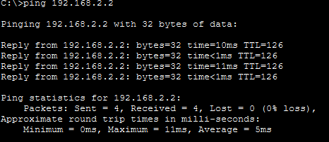
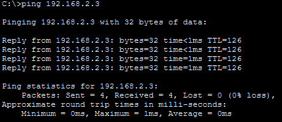

# Lab 5 : Configuration of static routes and default routes

## Objective
- To understand the concepts of static routing and default routing.
- To learn how to configure static routes and default routes on network devices using UI and CLI.

## Theory
- **Static Routing:** Static routing is a method where the router uses manually defined routes to forward packets. The routes stay constant until the administrator changes them. This type of routing is simple and reliable for networks with predictable traffic patterns.  

- **Default Routing:** A default route is used to handle packets that do not match any specific route in the routing table. It provides a general path for unknown destinations, ensuring that traffic can still reach external networks.  

- **CLI (Command Line Interface):** CLI is a text-based interface for interacting with network devices. Through CLI, administrators can enter commands to configure settings, manage network operations, and troubleshoot problems efficiently.


## Procedure
1. In Cisco Packet Tracer, create a network topology with at least two routers and multiple networks with multiple devices.
2. Assign IP addresses to all devices and configure basic settings such as IP addresses, subnet masks, and gateways.
3. Configure static routes on each router to enable communication between different networks. Use the following command in CLI mode:
   ```
   Router(config)# ip route [destination_network] [subnet_mask] [next_hop_address or exit_interface]
   ```

   **Basic Syntax:**
   ```
   Router> enable
   Router# configure terminal
   Router(config)# ip route <destination_network> <subnet_mask> <next_hop_address>
   ```

   **Router 1 Configuration Example:**
   ```
   Router> enable
   Router# configure terminal
   Router(config)# ip route 192.168.2.0 255.255.255.0 10.0.0.2
   ```

   **Router 2 Configuration Example:**
   ```
   Router> enable
   Router# configure terminal
   Router(config)# ip route 192.168.1.0 255.255.255.0 10.0.0.1
   ```

4. Configure a default route on each router to handle traffic destined for unknown networks. Use the following command in CLI mode:
   ```
   Router(config)# ip route 0.0.0.0 0.0.0.0 <next_hop_address or exit_interface>
   ```

   **Basic Syntax:**
   ```
   Router> enable
   Router# configure terminal
   Router(config)# ip route 0.0.0.0 0.0.0.0 <next_hop_address>
   ```

   **Router 1 Configuration Example:**
   ```
   Router> enable
   Router# configure terminal
   Router(config)# ip route 0.0.0.0 0.0.0.0 10.0.0.2
   ```

   **Router 2 Configuration Example:**
   ```
   Router> enable
   Router# configure terminal
   Router(config)# ip route 0.0.0.0 0.0.0.0 10.0.0.1
   ```
5. Verify the routing configuration by sending ping requests between devices on different networks. Use the following command in CMD mode:
   ```
   ping [destination_IP_address]
   ```

## Observations
- Successful ping responses indicate that the static routes and default routes are correctly configured, allowing communication between different networks.

## Output
<table>
   <tr>
      <td align="center">
         
         <br />Fig : Ping result using Static Route
      </td>
      <td align="center">
         
         <br />Fig : Ping result using Default Route
      </td>
   </tr>
   
</table>

## Conclusion
- This lab successfully demonstrated how to manually direct network traffic. We learned that static routing provides precise control over specific paths, while default routing ensures that the network has a functional exit point for all other traffic. Correct implementation of these routes is a fundamental skill for maintaining secure and predictable network communication.

